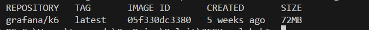

## Laboratorium: Testowanie wydajności aplikacji internetowej przy użyciu K6

# Cel laboratorium:

W ramach tego laboratorium uczestnicy zapoznają się z narzędziem K6 oraz technikami testowania wydajności aplikacji internetowych. Przykłady będą oparte na wykorzystaniu K6 w kontenerze Docker, co umożliwia szybkie uruchamianie testów bez konieczności instalacji narzędzia lokalnie.

# Wymagania wstępne

1. Docker - zainstalowany na komputerze uczestnika.
2. Podstawowa znajomość JavaScript - K6 wykorzystuje JavaScript do tworzenia skryptów testowych.
3. [Opcjonalnie] Zainstalowany [node](https://nodejs.org/en) aby utworzyć projekt. Nie jest to konieczne do ukończenia ćwiczenia.

# Wprowadzenie do K6

K6 to narzędzie open-source do testów wydajnościowych i obciążeniowych aplikacji. Dzięki prostym skryptom w JavaScript umożliwia przeprowadzenie testów symulujących rzeczywiste obciążenie, pomagając wykryć potencjalne problemy wydajnościowe. [Dokumencja K6.](https://grafana.com/docs/k6/latest/)

# Przygotowanie środowiska

- Zapoznaj się z sekcją na temat instalacji, interesuje nas wykorzystanie narzędzia docker [Instalcja k6 - docker](https://grafana.com/docs/k6/latest/set-up/install-k6/#docker)

- pobierz oficjalny Image narzędzia za pomocą komendy: `docker pull grafana/k6`
- sprawdź czy udało się pobrać obraz za pomocą komendy: `docker image ls` 

- [Opcjonalne, jeśli zainstalowany node] Jeśli korzystasz z narzędzi takich [Visual Studio Code](https://code.visualstudio.com/) to użyj komendy aby zainicjalizować projekt i dodać definicje typów K6 aby ułatwić sobie tworzenie testów:
  ```bash
  # create a package.json file
  npm init --yes
  #  install the k6 types as dev dependency
  npm install --save-dev @types/k6
  ```

# Utworzenie pierwszego testu

- utwórz nowy test za pomocą komendy: `  docker run --rm -i -v ${PWD}/scripts:/app -w /app grafana/k6 new`
- powinen utworzyć się folder `scripts` a nim przykładowy test `script.js`
- przejrzyj przykładowy test, co ten test robi?
- uruchom przykładowy test, aby sprawdzić czy wszystko jest poprawnie skonfigurowane `docker run --rm -i -v ${PWD}/scripts:/app -w /app grafana/k6  run ./script.js`
- Przeanalizuj dane wypisane do konsoli i odpowiedz na pytania

  - przez ile czasu wykonywał się test?
  - ile zapytań wysłał test?
  - do jakiego adresu oraz jakiego typu request HTTP był wykonywany?

# Wyjaśnienie bloku `options` oraz `export default function`

1. **Blok `options`** – Służy do ustawienia parametrów testu, takich jak liczba wirtualnych użytkowników (`vus`) oraz czas trwania testu (`duration`). Dzięki temu można łatwo sterować poziomem obciążenia testowanej aplikacji. **Bez definicji tego pola wysyłamy pojedyńcze zapytanie.**

   **Przykład `options`:**

   ```javascript
   export let options = {
     vus: 10, // liczba użytkowników wirtualnych (Virtual Users)
     duration: "30s", // czas trwania testu
   };
   ```

- Stwórzy skrypt testowy który:
  - Wykona dokładnie `100` zapytań z wykorzystaniem `1` vu
  - zapytania będą kierowane do `https://google.com`
  - odpowiedz na pytania:
      - jaki był średni czas trwania jednego zapytania?
      - ile trwał czały test?
   
Tutaj znajdziesz więcej informacji na temat możliwych parametrów w [sekcji options](https://grafana.com/docs/k6/latest/using-k6/k6-options/reference/)

2. **Funkcja `export default function`** – – Określa, jakie czynności wykona każdy wirtualny użytkownik podczas testu. Jest to główny blok logiki testu, gdzie definiujemy, jakie żądania są wysyłane oraz jakie warunki sprawdzamy za pomocą `check`;

   **Przykład `export default function`:**

   ```javascript
   export default function () {
     http.get("https://jsonplaceholder.typicode.com/posts");
     sleep(1);
   }
   ```

- zmodyfikuj przykładowy test tak aby:
  - aby test trwał `15s`
  - ilość wirtualnych użytkowników wynosiła 5
  - zapytania były kierowane do `https://google.com`
  - test zapisz jako `test_1.js` w folderze `scripts`
  - aby uruchomić test wystarczy że w poprzedniej komendzie uruchamiającej test zmienić końcówkę na odpowiednią nazwę `docker run --rm -i -v ${PWD}/scripts:/app -w /app grafana/k6  run ./{nazwaTwojegoTestu.js}`

# Testy z assercjami za pomocą funkcji check

Funkcja check jest kluczowa w narzędziu K6 do oceny, czy odpowiedzi aplikacji spełniają określone warunki. Pozwala na sprawdzenie różnych aspektów odpowiedzi HTTP, takich jak kod statusu, czas odpowiedzi, czy zawartość odpowiedzi.

Składnia funckji `check`:

```javasrcipt
    check(response, {
        'opis sprawdzanej wartości': (r) => r.warunek
    });
```

Przykład użycia:

```javascript
import http from "k6/http";
import { check, sleep } from "k6";

export default function () {
  let res = http.get("https://jsonplaceholder.typicode.com/posts");
  check(res, {
    "status was 200": (r) => r.status === 200, // sprawdza, czy kod odpowiedzi to 200
    "response time < 200ms": (r) => r.timings.duration < 200, // sprawdza, czy czas odpowiedzi jest krótszy niż 200 ms
  });
  sleep(1);
}
```

**Zadania:**

1. Utwórz skrypt, który sprawdzi czy body zwracane przez `https://www.google.com/` zawiera `Google`, http code zwracany to `200` oraz czy czas odpowiedzi jest krótszy niż `300ms`.
1. Utwórz skrypt, który sprawdzi czy endpoint GET `https://jsonplaceholder.typicode.com/users` zwraca równo 10 użytkoników.

# Testy z danamicznymi danymi

Dla symulacji zapytań z dynamicznymi danymi możemy zaimportować plik JSON.

```javascript
import http from "k6/http";
import { sleep, check } from "k6";
import { SharedArray } from "k6/data";

const testData = new SharedArray("test data", function () {
  return JSON.parse(open("./dataExample.json")); // plik JSON z danymi
});

export default function () {
  const randomPost = testData[Math.floor(Math.random() * testData.length)];
  let res = http.get(
    `https://jsonplaceholder.typicode.com/posts/${randomPost.id}`
  );
  check(res, {
    "status was 200": (r) => r.status === 200,
  });
  const post = res.json();
  console.log("Post ID: " + post.id);
  console.log("Post title: " + post.title);
  console.log("Post body: " + post.body);
  check(post, {
    "Post id equal requested post id": (p) => p.id == randomPost.id,
  });
}
```

**Zadanie**:

- Utwórz test w którym korzystjąc z danych testowych w `dataPosts.json` wyślesz conajmniej 10 zapytania POST do `https://jsonplaceholder.typicode.com/posts`, aby utworzyć nowe posty, następnie sprawdź czy status odpowiedzi to `200` czy w odpowiedzi znajduje się pole `id` oraz wypisz do konsoli jakie id (wartość `id`) dostał ten post. (możesz parę razy stworzyć ten sam post)

# Zadania końcowe

- Przygotuj skrypt testowy dla aplikacji opartej na API (np. darmowe API publiczne) wykorzystujący różne endpointy i sprawdź czas odpowiedzi.
- Użyj dynamicznych danych, aby zasymulować różne żądania użytkowników i zobaczyć, jak aplikacja reaguje na obciążenie.
